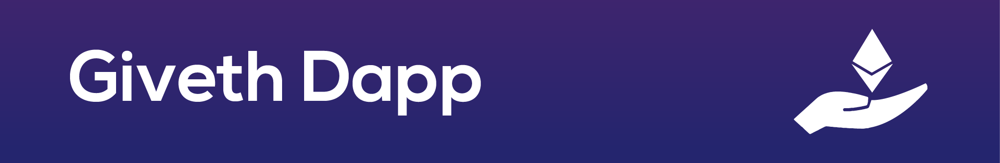

> DApp - Donation Application for charitable giving without losing ownership

Welcome to the code for Giveth's DApp. This is an open source effort to realize the potential of ethereum smart contracts. More specifically, the Giveth DApp provides an alternative to traditional donation.

## Table of content

- [Table of content](#table-of-content)
- [Getting Started](#getting-started)
    - [Prerequisities](#prerequisities)
  - [Install](#install)
    - [OSX and Linux](#osx-and-linux)
    - [Windows](#windows)
  - [Run](#run)
  - [Build](#build)
  - [Configuration](#configuration)
  - [Analytics](#analytics)
- [Contributing](#contributing)
  - [Local Development](#local-development)
  - [Development and PR Testing](#development-and-pr-testing)
  - [Deployment Environments](#deployment-environments)
  - [Release Process](#release-process)
- [Help](#help)

## Getting Started
In the following sections you will learn all you need to know to run the DApp locally and to start contributing. All the steps are also described in this amazing [Video Tutorial Walkthrough](https://tinyurl.com/y9lx6jrl) by Oz.

#### Prerequisities
- You need to use Node > v8, however, v10 does not work correctly yet.
- You need to use npm > v5.4, or yarn > v1.6 to correctly install the dependencies.

### Install
1. Click **Star** on this repo near the top-right corner of this web page (if you want to).
2. Join us on [Riot](http://join.giveth.io) if you haven't already.
3. Fork this repo by clicking **Fork** button in top-right corner of this web page. Continue to follow instruction steps from your own giveth-dapp repo.
4. Clone your own "giveth-dapp" repo. Copy the link from the "Clone or download" button near the top right of this repo's home page.
5. The rest of these steps must be done from your machine's command line. See the [OSX and Linux](#for-osx-and-linux) or [Windows](#for-windows) section to continue.

#### OSX and Linux
If your operative system is any distrubution of linux you can use an All in One installation scripts special thanks to Dapp contributor Jurek Brisbane, available [here](https://github.com/Giveth/giveth-dapp/files/3674808/givethBuildStartScripts_2019-09-29.zip) along with a youtube [video](https://www.youtube.com/watch?v=rzLhxxAz73k&feature=youtu.be), otherwise try the following:

1. From the desired directory you wish to copy the "giveth-dapp" folder with source files to.
    ```
    git clone {paste your own repo link here}
    ```
    NOTE: Please use `develop` branch for contributing.
    ```
    git clone -b develop {paste your own repo link here}
    ```
2. Change directories to giveth-dapp:
    ```
    cd giveth-dapp
    ```
3. Make sure you have [NodeJS](https://nodejs.org/) (v8.4.0 or higher) and [npm](https://www.npmjs.com/) (5.4.1 or higher) installed.
4. Install dependencies from within giveth-dapp directory:
    ```
    npm install
    ```
5. That is it, you are now ready to run the giveth-dapp! Head to the [Run DApp](#run) section for further instructions.

#### Windows
1. Make sure you have the LTS version of [64-bit NodeJS](https://nodejs.org/en/download/current) (v8.9.1)
2. Run the node-v8.9.1-x64.msi installer and then continue through the installation as normal. Be sure to have the "Enable in PATH" option enabled before installing.
3. Open the command line in administrator mode by right clicking on the cmd.exe application and selecting "Run as administrator"
4. In the administrator command prompt, change to the directory where you want to store this repository.
   ```
   cd C:\some\directory\for\repositories
   ```
5. Update npm to the latest version (in order to make sure the next step has the latest dependencies to install) with:
   ```
   npm install npm@latest -g
   ```
6. You must install the NodeJS/NPM dependcies for Windows before you are able to continue. This command will take a few minutes to install all of the necessary dependencies for building NodeJS applications on Windows.
   ```
   npm install -g windows-build-tools
   ```
7. Install dependencies from within giveth-dapp directory:
    ```
    npm install
    ```
8. For some reason the npm node-sass package does not install correctly in windows when using the 'npm install' command, so you must rebuild the node-sass package with:
   ```
   npm rebuild node-sass
   ```
9. The web3 package does not install correctly when using the 'npm install' command, so you must install it separately in order for this dapp to run. Use the following to install web3:
   ```
   npm install web3
   ```
10. That is it, you are now ready to run the giveth-dapp! Head to the [Run dapp](#run-dapp) section for further instructions.

### Run
1. The Giveth dapp will need to connect to a [feathers-giveth](https://github.com/Giveth/feathers-giveth) server. Follow the feathers-giveth readme instructions to install and run server before proceeding further. Alternatively, you could change the configuration to connect to the `develop` environment, see the [Configuration](#configuration) section.
2. Start the dapp.
    ```
    npm start
    ```
3. Once the dapp is up in your browser, click "Sign In" from the main menu.
4. For testing locally, choose any of the wallet files found in the `giveth-dapp/keystores/` folder using the wallet password: `password`. **DO NOT USE THESE ON ANY MAINNET EVMs.**

5. Using the test token
  To use the test token you need to import the keystore.json you use for your account to MetaMask.
  After importing, click on 'Add token' > 'Custom token' and enter the MiniMe Token address that can be found when deploying the contracts
  (should be `0xe78A0F7E598Cc8b0Bb87894B0F60dD2a88d6a8Ab` by default but make sure to check)
  The token balance should show up automatically and the token symbol is MMT.
  However, in the dApp the token symbol is referred to as ANT, b/c the dapp needs to be able to fetch a conversion rate.

  NOTE: 
  When resetting feathers or redeploying the contracts, you need to remove the keystore from metamask and follow this procedure again.

### Build
```
npm run build
```

NOTE: due to some web3 libraries that are not transpiled from es6, we have to use our [giveth-react-scripts](https://github.com/Giveth/create-react-app/tree/master/packages/react-scripts) fork of react-scripts .

### Configuration
The DApp has several node environment variables which can be used to alter the DApp behaviour without changing the code. You can set them through `.env` or `.env.local` files in the DApp folder.

Variable name | Default Value | Description |
---|---|---|
PORT | 3010 | Port on which the DApp runs |
REACT_APP_ENVIRONMENT | 'localhost' | To which feathers environment should the DApp connect. By default it connects to localhost feathers. Allowed values are: `localhost`, `develop`, `release`, `alpha`, `mainnet`. See [Deployment Environments](#deploy-environments). |
REACT_APP_DECIMALS | 8 | How many decimal should be shown for cryptocurrency values. Note that the calculations are still done with 18 decimals. |
REACT_APP_FEATHERJS_CONNECTION_URL | Differs per REACT_APP_ENVIRONMENT | Overwrites the environment injected feathers connection URL. |
REACT_APP_NODE_CONNECTION_URL | Differs per REACT_APP_ENVIRONMENT | Overwrites the EVM node connection URL for making EVM transactions. |
REACT_APP_LIQUIDPLEDGING_ADDRESS | Differs per REACT_APP_ENVIRONMENT | Overwrites the Liquid Pledging contract address. |
REACT_APP_DAC_FACTORY_ADDRESS | Differs per REACT_APP_ENVIRONMENT | Overwrites the DACs contract address. |
REACT_APP_CAMPAIGN_FACTORY_ADDRESS | Differs per REACT_APP_ENVIRONMENT | Overwrites the Campaign Factory contract address. |
REACT_APP_MILESTONE_FACTORY_ADDRESS | Differs per REACT_APP_ENVIRONMENT | Overwrites the MilestoneFactory contract address. |
REACT_APP_TOKEN_ADDRESSES | Differs per REACT_APP_ENVIRONMENT | Overwrites the bridged token addresses. This is a JSON object string w/ token name : token address. |
REACT_APP_BLOCKEXPLORER | Differs per REACT_APP_ENVIRONMENT | Overwrites the block explorer base URL. The DApp assumes such blockexplorer api is `\<BLOCKEXPLORER\>/tx/\<TRANSACTION_HASH\>` |
REACT_APP_DEFAULT_GASPRICE | 10 | Overwrites the default gasPrice that is used if ethgasstation service is down. The value is in gwei. |

Example of `.env.local` file that makes the DApp run on port 8080, connects to the **develop** environment and uses custom blockexplorer:

```
PORT=8080
REACT_APP_ENVIRONMENT='develop'
REACT_APP_BLOCKEXPLORER='www.awesomeopensourceexplorer.io'
```

The rest of the configuration can be found in `configuration.js`

### Analytics
Google analytics and Hotjar can be enabled per environment:
```
    analytics: {
      ga_UA: 'UA-12345678-1',     // Your Google Analytics tracking code
      useGoogleAnalytics: true,   // Whether to enable GA
      useHotjar: false            // Whether to enable Hotjar
    }
```

The following events are tracked with Google Analytics:
- pageviews
- signup 
- signin
- creation of DACs/Campaigns/Milestones
- editing of DACs/Campaigns/Milestones
- making donations
- actions on milestones

**DO NO USE ANY OTHER THAN DEVELOP ENVIRONMENT FOR DEVELOPING AND TESTING.**

### Query Strings
The milestone creation/proposal view now supports query string arguments!
The following arguments are available:

| Argument | Expected Values | Type |
|------------------|------------------------------------------------------------|--------|
| title | The title of the milestone | string |
| description | The description of the milestone | string |
| recipientAddress | The address of the recipient | string |
| reviewerAddress | The address of the reviewer | string |
| selectedFiatType | A valid fiat type (i.e. USD) | string |
| date | A valid milestone date string | string |
| token | A valid token symbol (i.e. DAI) | string |
| tokenAddress | A valid token address | string |
| maxAmount | A valid max amount of ETH or token | number |
| fiatAmount | A valid max amount of fiat (dependant on selectedFiatType) | number |
| isCapped | Determines whether the milestone should be capped | 0 or 1 (boolean) |
| requireReviewer | Determines whether the milestone should require a reviewer | 0 or 1 (boolean) |


## Contributing
The DApp is fully open-source software, and we would love to have your helping hand! See [CONTRIBUTING.md](CONTRIBUTING.md) for more information on what we're looking for and how to get started. You can then look for issues labeled [good first issue](https://github.com/Giveth/giveth-dapp/labels/good%20first%20issue) or [help wanted](https://github.com/Giveth/giveth-dapp/labels/help%20wanted). We regularly reward contributions with ether using the Reward DAO.

If you are not a developer, you can still help us by testing new releases periodically. See the [Release Process](#release-process) section.

If you want to better understand how does the development process works, please refer to our [wiki pages](https://wiki.giveth.io/documentation/DApp), especially to the [Product Definition](https://wiki.giveth.io/documentation/DApp/product-definition/), [Product Roadmap](https://wiki.giveth.io/documentation/DApp/product-roadmap/) and [Development Process & Quality Assurance](https://wiki.giveth.io/documentation/DApp/product-development-testing/).

### Local Development
At first you would like to run the DApp locally. When running `testrpc` locally in `deterministic` mode, you can use any of the keystores in the `giveth-dapp/keystores` as your wallet.
This will provide you access to the testrpc accounts for local development. Each keystore uses the same password: `password`. **DO NOT USE THESE ON ANY MAINNET EVMs**

The keystores are seeded with 10.000 ANT tokens for testing donations. To get started with testing donations,
make sure to add your account's keystore to MetaMask and swith MetaMask to Ganache. The donation modal should
then show the appropriate balance when donating in ANT tokens.

**NOTE**: If you get a nonce error in MetaMask or if the dapp fails to load with your metamask unlocked, it could be b/c metamask is confused. You should go to "settings" -> "Reset Account" in MetaMask in order to reset the nonce & cached account data.

### Development and PR Testing
1. The Giveth Dapp is auto deployed from the develop branch and is live on Rinkeby [develop.giveth.io](https://develop.giveth.io). All pull requests are autodeployed and the PR preview will be generated upon submission. To learn how to access PR previews see [Development Process & Quality Assurance](https://wiki.giveth.io/documentation/DApp/product-development-testing/) on our wiki.
2. In order to use the dapp you will need to create account. If this is your first time, click "sign up" to create an account. If you already have a valid keychain file, use it to sign in.
3. You will need test ether on the Rinkeby network. Go to the "wallet" page to see your new address (0x..). Copy that address and use the faucet to get some: https://faucet.rinkeby.io/


### Deployment Environments
At Giveth, we are using the [gitflow](http://nvie.com/posts/a-successful-git-branching-model/) branching model to deploy to 4 different environments.

Name | Blockchain | Branch Deployed | Auto Deploy | Use |
-----|------------|-----------------|-------------|-----|
[mainnet](https://mainnet.giveth.io) | Ethereum Main Network | master | no | Main network deployment for now abandoned due to high transaction costs until sustainable solution is found.
[alpha](https://alpha.giveth.io)  | Rinkeby Test Network | master | no | Environment used as a production version until scalability is resolved.
[release](https://release.giveth.io) | Rinkeby Test Network | release | yes | Environment for release candidate quality control testing by non-devs.
[develop](https://develop.giveth.io) | Rinkeby Test Network | develop | yes | Development environment for integrating new features. Feature and pull request branches are also automatically deployed to this environment.

You can change the environment to which the DApp connects through the node environment variables. See the [Configuration](#Configuration) section for more details.

### Release Process
The development uses the Gitflow process with 2 weeks long sprints. This means there is new release to be tested every fortnight. We invite contributors to help us test the DApp in the release 
environment before we merge it to the master branch and deploy to production environments. If you are interested, write to the DApp Development channel on [Riot](https://join.giveth.io). You can read more about the release planning on [our wiki](https://wiki.giveth.io/documentation/DApp/product-development-testing/).

## Help
Reach out to us on [Riot](https://join.giveth.io) for any help or to share ideas.
