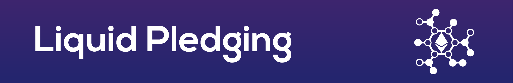

> Ethereum contract to delegate donations to projects.

[](https://travis-ci.org/Giveth/liquidpledging)

Welcome to the code for the liquidpledging contract, a new way to distribute donated ether while keeping ownership in the hands of the original donor.

## Table of content

- [Getting Started](#getting-started)
    - [Install](#install)
    - [Requirements](#requirements)
    - [Package](#package)
- [Run demo](#run-demo)
- [Help](#help)

### Install
1. Click **Star** on this repo near the top-right corner of this web page (if you want to).
2. Join our [slack](http://slack.giveth.io) if you haven't already.
3. Fork this repo by clicking **Fork** button in top-right corner of this web page. Continue to follow instruction steps from your own liquidpledging repo.
5. The rest of these steps must be done from your machine's command line. Clone your own "liquidpledging" repo: 
    ```
    git clone https://github.com/GITHUB_USERNAME/liquidpledging.git
    ```
6. Change directories to liquidpledging:
    ```
    cd liquidpledging
    ```

### Requirements
Make sure you have [NodeJS](https://nodejs.org/) (v8.4.0 or higher) and [npm](https://www.npmjs.com/) (5.4.1 or higher) installed.

### Package
The liquidpledging contract is published as an npm package for developer convenience. To include it as a dependency in your package.json run this from your apps root dirctory.
```
 npm install liquidpledging --save
```

## Run demo
Follow the instructions on the [liquidpleding-demo](https://github.com/ojones/liquidpledging-demo) repo.
 
## Help
Reach out to us on [slack](http://slack.giveth.io) for any help or to share ideas.
